# Stock-Analysis-using-Python

This project analyzes stock performance using Python to uncover trends, correlations, and patterns in daily price movements. It includes computations for returns, volatility, moving averages, and visual comparisons among multiple technology stocks.

##  Features  
- **Daily Stock Chart** – Visualized daily stock chart
  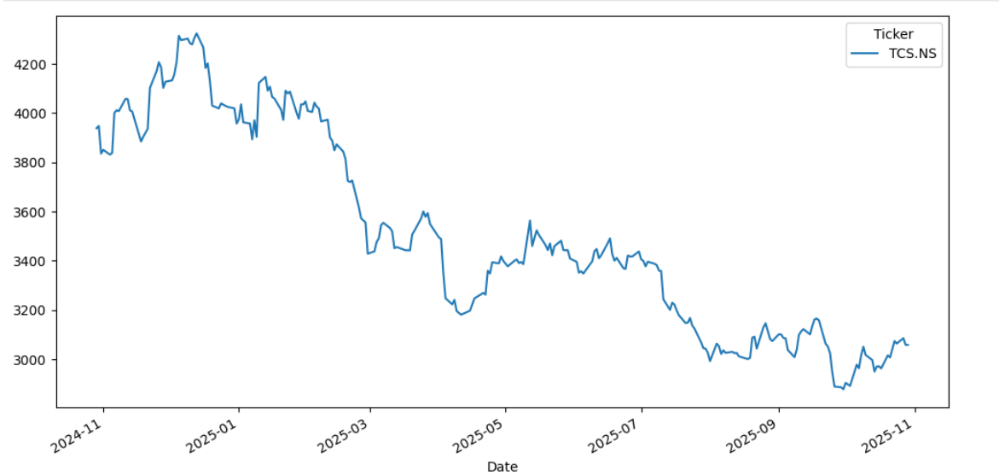
- **Daily Returns Analysis** – Calculates and visualizes day-to-day percentage changes
  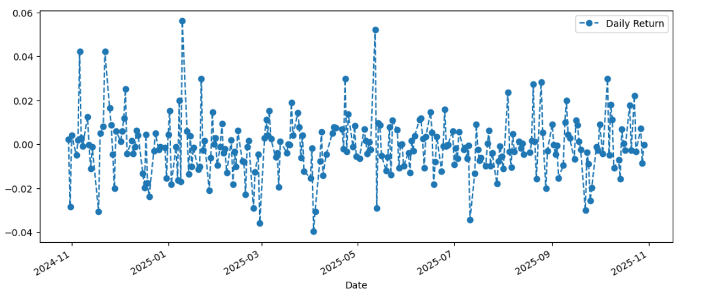
- **Cumulative Returns** – Tracks the overall growth of investment over time
 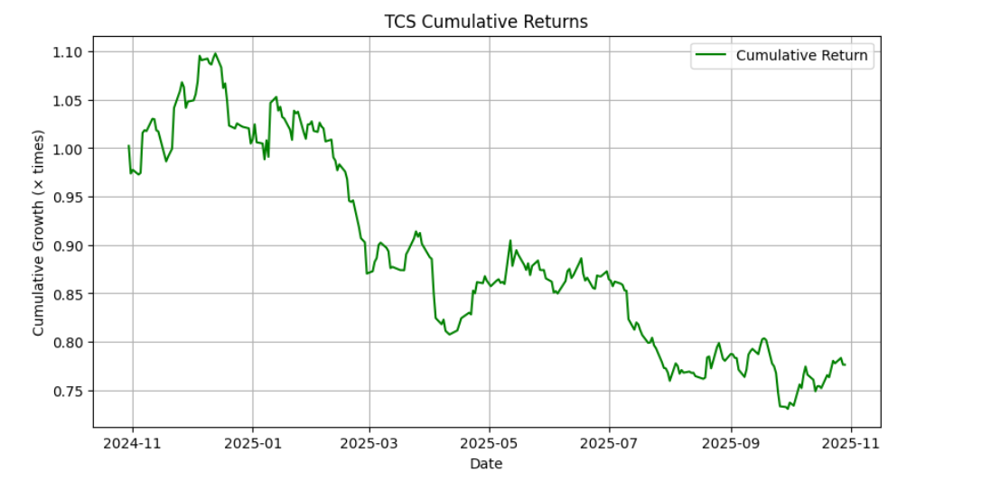
- **Moving Averages (20, 50, 200 Days)** – Detects short-term and long-term trends
  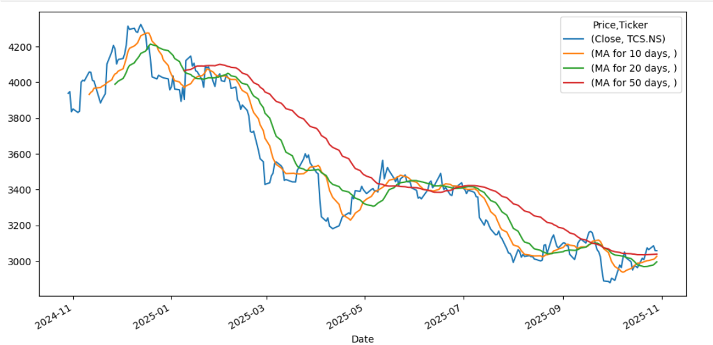
- **Rolling Volatility** – Measures risk and uncertainty in stock performance
  *** One Stock ***
 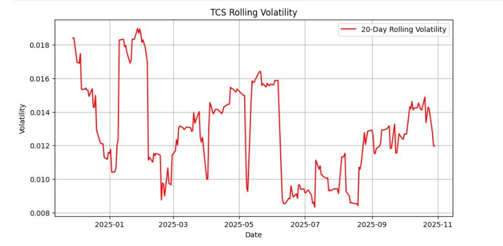
  *** Multiple Stock ***
 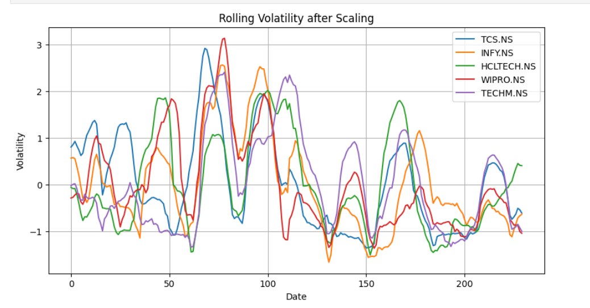
- **Volume Analysis** – Examines trading activity and market momentum
 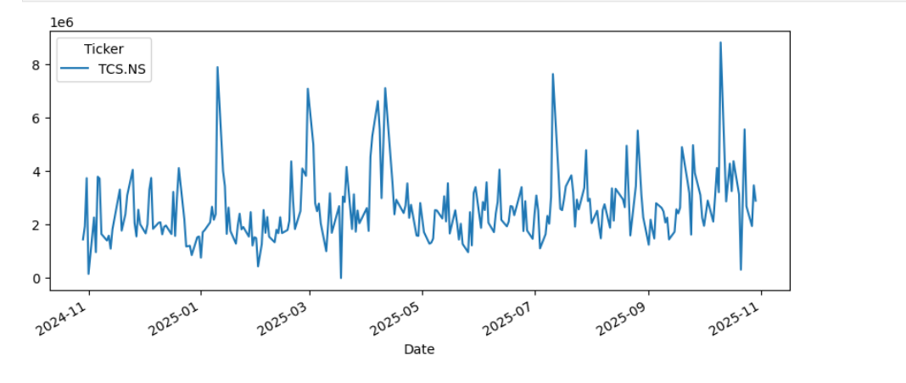
- **Box & KDE Plots** – Displays the distribution and spread of returns
 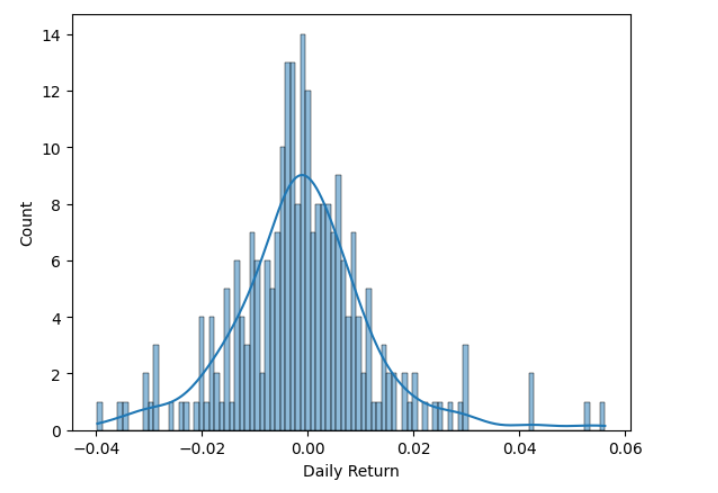
 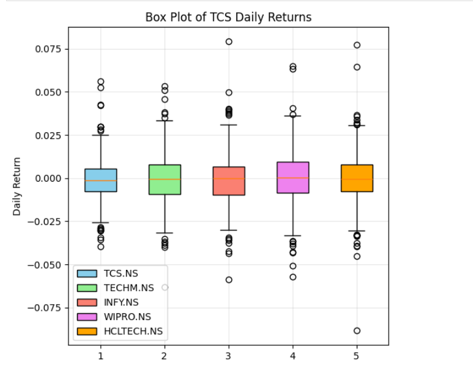
- **Correlation Heatmap** – Highlights relationships among different stock returns
 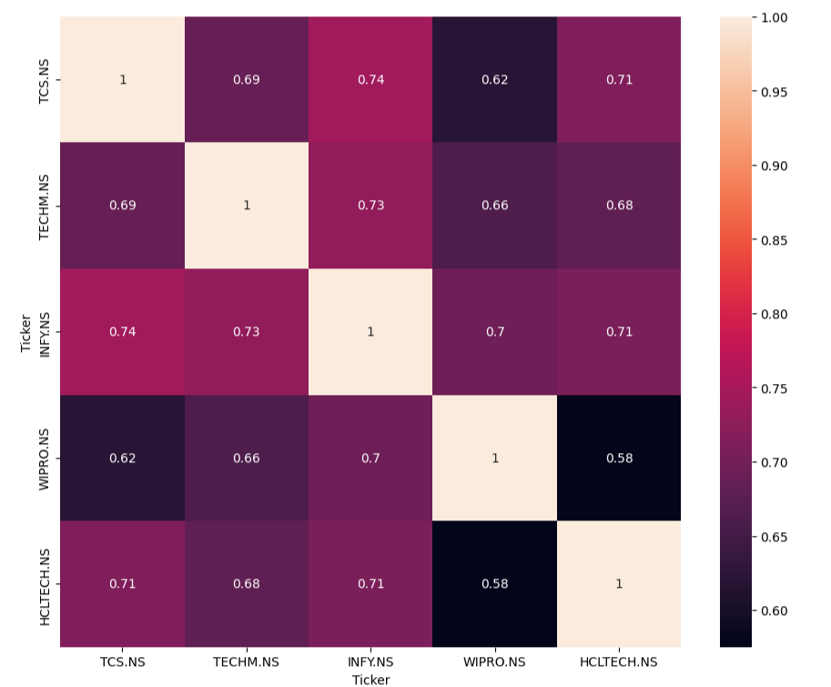
**Risk vs Return ** – Showing the risk and their respective stock returns
  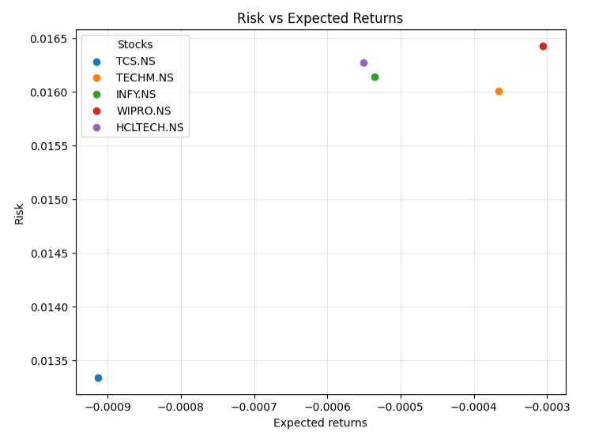

- 
  ## 📦 Tech Stack  

- **Python** 
- **Pandas**
- **NumPy** 
- **Matplotlib & Seaborn**   
- **Scikit-learn** – StandardScaler  
- **yfinance** – Stock data collection  
